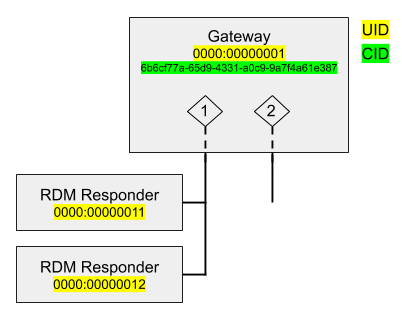
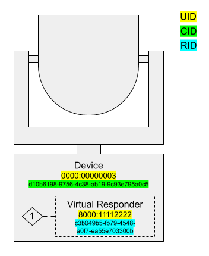

# Devices and Gateways                                                      {#devices_and_gateways}

<!-- LANGUAGE_SELECTOR -->

RDMnet is closely tied to Streaming ACN (ANSI E1.31, aka sACN); RDMnet devices are often also
senders or receivers of sACN. Typically, sACN is used for live control data, whereas RDMnet is used
for "pre-show" configuration. This pairing between the two protocols motivates RDMnet's model of a
device.

## Modeling an RDMnet Device

Devices can be thought of as containing a set of RDM responders, each of which accepts some RDM
configuration. Every device has a special RDM responder known as the _Default Responder_ which
represents the top-level configuration data about the device - its name, manufacturer, IP
addressing information, etc.

If a device only implements RDMnet, not RDM or sACN, the default responder is all that's needed; it
can contain all of the RDMnet-configurable information about the device. But when a device starts
interacting with sACN or RDM, things get a bit more complex.

### Endpoints

Consider the example of a 2-port DMX/RDM gateway:



One of the main ways RDMnet adds value is by providing a standard way of interfacing with RDM
responders through gateways. Each port on the two-port gateway is represented by an _endpoint_ in
the RDMnet protocol. RDM responders are associated with endpoints; this association represents
which gateway port they are connected to.

ANSI E1.37-7, an extension to RDM, provides RDM messages for getting information about RDMnet
gateways. The `ENDPOINT_LIST` message is used to retrieve a list of endpoints on a gateway, and the
`ENDPOINT_RESPONDERS` message is used to get a list of RDM responders on each endpoint.

Every RDM responder except for the default responder is associated with an endpoint. Endpoint
numbers are 16-bit values, starting at 1. To address a responder on an endpoint, you must include
the endpoint number in the RDMnet message. When addressing the default responder, this field is set
to a reserved value, `NULL_ENDPOINT` (0).

In the above figure, the default responder has a UID `0000:00000001`. To send an RDM command
addressed to the gateway itself, using the RDMnet controller API, we would use the following
addressing information:

<!-- CODE_BLOCK_START -->
```c
RdmnetDestinationAddr to_gateway = RDMNET_ADDR_TO_DEFAULT_RESPONDER(0x0000, 0x00000001);

// This convenience initialization macro is equivalent to:
to_gateway.rdmnet_uid = gateway_uid; // { 0x0000, 0x00000001 }
to_gateway.endpoint = E133_NULL_ENDPOINT;
to_gateway.rdm_uid = gateway_uid; // { 0x0000, 0x00000001 }
to_gateway.subdevice = 0;
```
<!-- CODE_BLOCK_MID -->
```cpp
auto to_gateway = rdmnet::DestinationAddr::ToDefaultResponder(0x0000, 0x00000001);
```
<!-- CODE_BLOCK_END -->

The gateway is also connected to two RDM responders, which are attached to port 1 (which the
gateway represents over RDMnet as endpoint 1). To address one of these responders, we would:

<!-- CODE_BLOCK_START -->
```c
RdmUid responder_uid = {0x0000, 0x00000012};

RdmnetDestinationAddr to_responder = RDMNET_ADDR_TO_SUB_RESPONDER(0x0000, 0x00000001, 1, 0x0000, 0x00000012);

// This convenience initialization macro is equivalent to:
to_responder.rdmnet_uid = gateway_uid; // { 0x0000, 0x00000001 }
to_responder.endpoint = 1;
to_responder.rdm_uid = responder_uid; // { 0x0000, 0x00000012 }
to_responder.subdevice = 0;
```
<!-- CODE_BLOCK_MID -->
```cpp
auto to_responder = rdmnet::DestinationAddr::ToSubResponder(
    rdm::Uid(0x0000, 0x00000001), // The gateway's UID
    1,                            // The endpoint
    rdm::Uid(0x0000, 0x00000012)  // The RDM responder's UID
);
```
<!-- CODE_BLOCK_END -->

### Patching ports to sACN universes

ANSI E1.37-7 provides the `ENDPOINT_TO_UNIVERSE` RDM command which allows a nonzero endpoint to be
assigned to a universe of sACN. The default responder handles this command and uses it to manage
the patching of ports to DMX universes; this provides a standard way to assign universes to ports
on RDMnet-enabled gateways.

Note that this only handles basic one-to-one patching 

### Virtual Endpoints and Virtual Responders

In RDMnet, devices that consume sACN without converting it to the DMX512 physical layer represent
this functionality using _virtual endpoints_, which contain _RPT responders_ (aka
_virtual responders_). A good example of this is a network-connected moving light:


As above, the device's _default responder_ (represented by UID `0000:00000003`) represents the
device's top-level RDMnet configuration information. The portion of the device that acts on sACN
data is modeled as endpoint 1, and can be patched to an sACN universe by the `ENDPOINT_TO_UNIVERSE`
command. A _virtual responder_ (represented by the dynamic UID `8000:11112222`) receives RDM
commands related to the device's DMX operation, including setting the DMX start address.

One way to think of a network-connected fixture in RDMnet is as containing a virtual one-port
gateway, with the actual fixture (and its RDM responder) connected to its DMX512 port. The default
responder represents the properties of the fixture's RDMnet gateway, and the virtual responder
represents the properties of the fixture itself.

#### Responder IDs

Both top-level RDMnet devices and virtual responders can be identified by dynamic UIDs (see
\ref roles_and_addressing for more information on dynamic UIDs). Because the UID of these
responders can change over time, RDMnet requires them to also have an unchanging identifier that
controllers can use as a primary key for the responder. For default responders, this unchanging
identifier is the device's CID. However, virtual responders do not have a CID and thus must have a
different identifier. This identifier is (you guessed it) another UUID, called a Responder ID
(RID).

Here is an updated version of the previous example with the full set of identifying information
about the responders, including the persistent identifiers:



RIDs are not present in the RDM messaging used in RDMnet; mappings between RID and UID are provided
by a broker on request from a controller.
